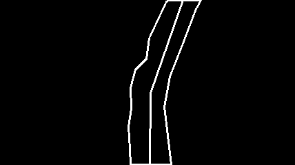
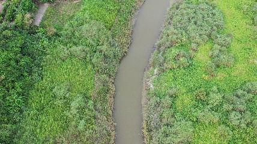
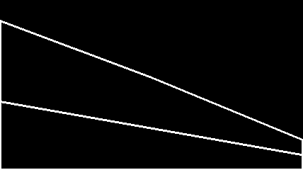
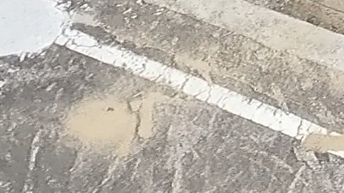
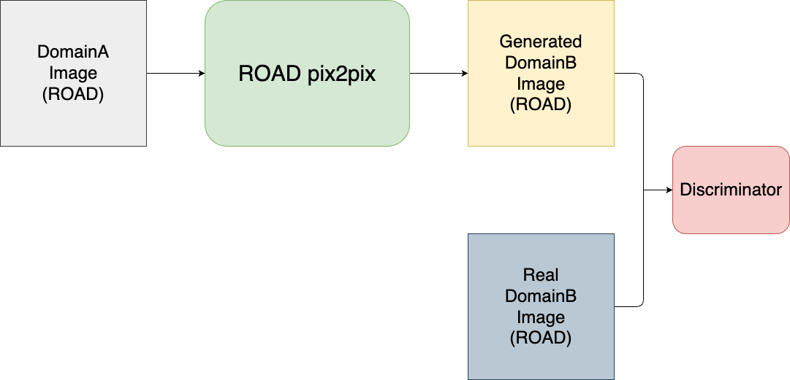
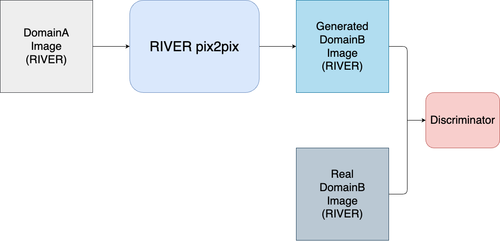

# AI-cup-2024-spring
Image Data Generation Competition

- Team ID: TEAM_5574
- Place: 21(Public), 14 (Private)
- Member:
    - 藍翊庭, NCKU (Leader)
    - 周韋恩, NCKU
    - 呂軒名, NCKU
    - 連思涵, NCKU

## Introduction
Our task is to translate the black-and-white draft image into drone imagery.

| Draft Image             | Drone Image            |
| ------------------------- | ------------------------- |
|  |  |

## Dataset Preprocess

- Remove Low-Quality Images:

    We first analyze the dataset and saw some low-quality images. We then remove the low-quality images.
some low-quality images are:

    | Low Quality Draft Image             | Low Quality Drone Image            |
    | ------------------------- | ------------------------- |
    |  |  |

- Split Dataset into 2 domains: (ROAD and RIVER)

    We extract the dataset from the raw training dataset and split it into two domains: ROAD and RIVER.
    ```
    dataset
    ├── train_ROAD
    │   ├── trainA (Draft Images)
    │   └── trainB (Drone Images)
    └── train_RIVER
        ├── trainA (Draft Images)
        └── trainB (Drone Images)
    ```

## Model Pipeline
### ROAD Model

### RIVER Model


## Hyperparameters
### Training
We train the 2 model with the following hyperparameters:
- Epochs: 1000 (n_epochs=900, n_epochs_decay=100)
- Batch Size: 1

### Testing
After training, We get the net_G for each model and use it to generate the drone image from the draft image.
We eventually choose 550_net_G.pth for ROAD model and 550_net_G.pth for RIVER model.

## Results
| Public Testing | Private Testing   |
| -------------- | ----------------- |
| 132.952698   | 131.1052 |