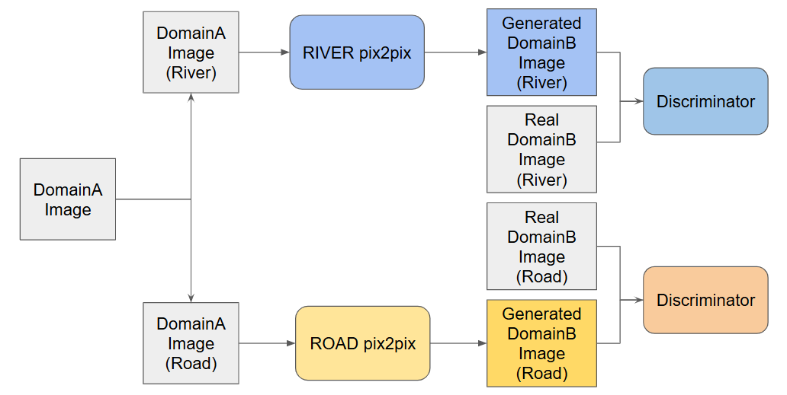
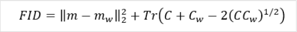

# AI-cup-2024-spring
[Image Data Generation Competition](https://tbrain.trendmicro.com.tw/Competitions/Details/34)

Follow the [steps](#setup) to reproduce our results.

- Team ID: TEAM_5574
- Place: 14 (Private)
- Member:
    - 藍翊庭, NCKU (Leader)
    - 周韋恩, NCKU
    - 呂軒名, NCKU
    - 連思涵, NCKU

## Introduction
Our task is to translate the black-and-white draft image into drone imagery.

| Draft Image             | Drone Image            |
| ------------------------- | ------------------------- |
|  |  |

## Dataset Preprocess

- Remove Low-Quality Images:

    We first analyze the dataset and saw some low-quality images. We then remove the low-quality images.
some low-quality images are:

    | Low Quality Draft Image             | Low Quality Drone Image            |
    | ------------------------- | ------------------------- |
    |  |  |

- Split Dataset into 2 domains: (ROAD and RIVER)

    We extract the dataset from the raw training dataset and split it into two domains: ROAD and RIVER.
    ```
    dataset
    ├── train_ROAD
    │   ├── trainA (Draft Images)
    │   └── trainB (Drone Images)
    └── train_RIVER
        ├── trainA (Draft Images)
        └── trainB (Drone Images)
    ```

## Model Pipeline


## Hyperparameters
### Training
We train the 2 model with the following hyperparameters:
- Epochs: 1000 (n_epochs=900, n_epochs_decay=100)
- netG = unet_256
- Batch Size: 1

### Testing
After training, We get the net_G for each model and use it to generate the drone image from the draft image.
We eventually choose 550_net_G.pth for ROAD model and 550_net_G.pth for RIVER model.

## Evaluation Metric
- FID (Fréchet Inception Distance) : 計算真實影像和生成影像之特徵距離，越低表示圖像品質越好。

- Final Score : 河流影像與道路影像會個別計算一個 FID 分數，FIDriver, FIDroad 分別加權評分後得到最終分數。


## Results
Use the **Final score** to evaluate the performance about each models.
| Model                                                 | Public Testing | Private Testing   |
| ----------------------------------------------------- | -------------- | ----------------- |
| Baseline                                              | 249.76       | 247.94                 |
| **Enhanced**                                          | **132.95**   | **131.11** |


## Setup
To reach our results, you can follow the steps below:
1. run `dataset/preprocess_dataset.ipynb`
2. run `train_model.ipynb` (optional, we have provided the pretrained model)
3. run `test_model.ipynb`
